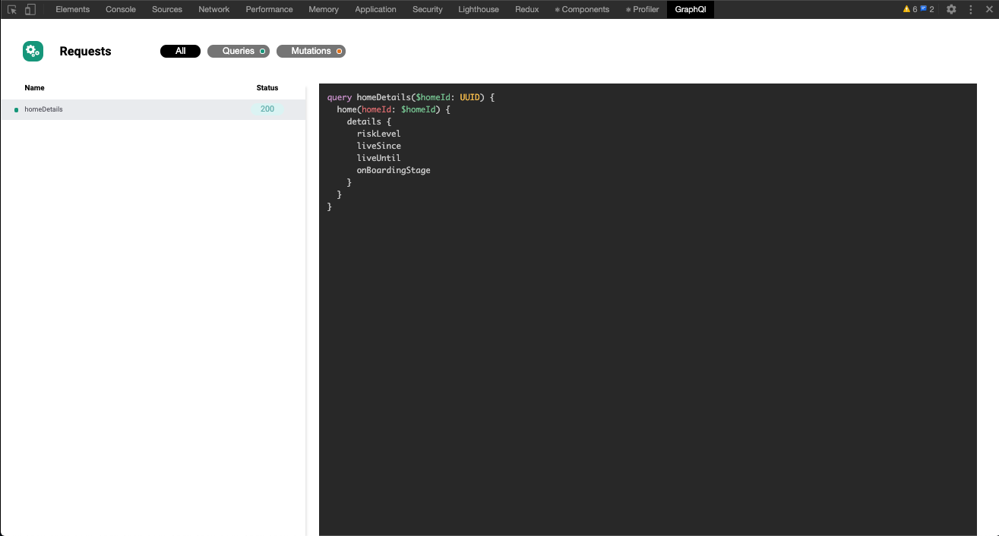

# WIP

The frameworkless graphql devtools, focusing in a good DX



# Development

All we have to do is install the dependencies:

```sh
$ yarn
```

Then run our development server:

```sh
$ yarn start
```

Then load the extension in your Chrome browser:

1. Access `chrome://extensions`;
2. Enable the `Developer mode` (top-right corner);
3. Click on `Load unpacked`;
4. Select the `graphql-devtools/build` dir.

Finally, open any website running GraphQL, open your DevTools and then select the `GraphQl` tab.

> Later we might discuss the possibility of introducing a sample webpage as well with a few buttons to perform different requests, so that we don't have to open a random website to test our extension.

### Every change still needs a manual work

Due the way extensions work, on every change, we still need to do some manual work.

In the app running inside the `GraphQl` tab, right-click and then select `Reload frame`. It will reload the extension page with any updated code.
